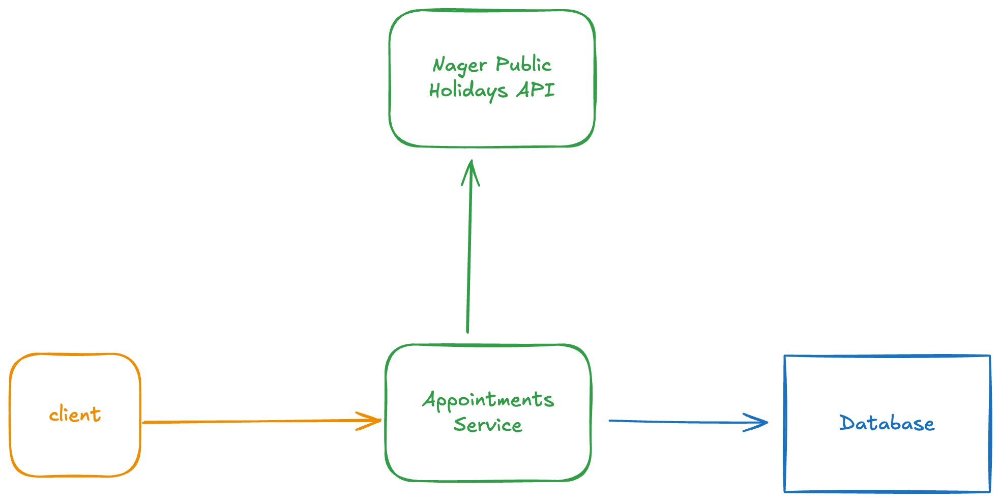

# Tabeo Code Challenge

A Go-based RESTful API for managing appointments, with public holiday validation, caching, and robust error handling. Built using Fiber v3, GORM, MySQL, Redis, and a modular clean architecture.

## Features

- Create and manage appointments
- Prevents appointments on public holidays (per country/year)
- Public holidays fetched from external API and cached in Redis
- MySQL for persistent storage
- Configurable via YAML files
- Structured logging
- Full test suite (unit and integration)
- Dockerized for easy local development

## Architecture



- **cmd/tabeo**: Application entrypoint
- **internal/adapter**: HTTP handlers, cache, and repository implementations
- **internal/core**: Business logic and domain entities
- **internal/infra**: Infrastructure (DB, config, logger)
- **internal/pkg**: Shared packages (errors, logger)
- **config/**: YAML configuration files
- **deployments/**: Docker Compose and DB setup

## Requirements

- Go 1.25+
- Docker & Docker Compose
- MySQL
- Redis

## Setup

1. **Clone the repository**
   ```sh
   git clone <repo-url>
   cd tabeo-code-challenge
   ```

2. **Configure environment**
   - Edit `config/local.yml` for local settings (DB, Redis, cache TTL, etc.)

3. **Start dependencies**
   ```sh
   make docker-up
   ```

4. **Build and run**
   ```sh
   make build
   make run
   ```

5. **Run tests**
   ```sh
   make test
   ```

6. **Stop dependencies**
   ```sh
   make docker-down
   ```

## Usage

### API Endpoints

- `POST /appointments` — Create a new appointment
- `GET /health` — Health check

### Example Request

```json
POST /appointments
{
  "first_name": "John",
  "last_name": "Doe",
  "visit_date": "2025-01-01"
}
```

### Error Handling

- Returns appropriate HTTP status codes and error messages.
- Custom error types: `Internal`, `BadGateway`, `Conflict`, etc.

## Caching Strategy

- Public holidays are cached in Redis using a key format: `holidays:{year}:{country}`
- Value: JSON array of holidays for that year/country
- LRU eviction policy with configurable TTL (see `config/local.yml`)
- On cache miss, fetches from external API, stores in DB and cache

## Testing

- Unit and integration tests in `internal/core/usecase` and `test/integration`
- Mocks for repositories, cache, and logger
- Run all tests: `make test`

## License

MIT

